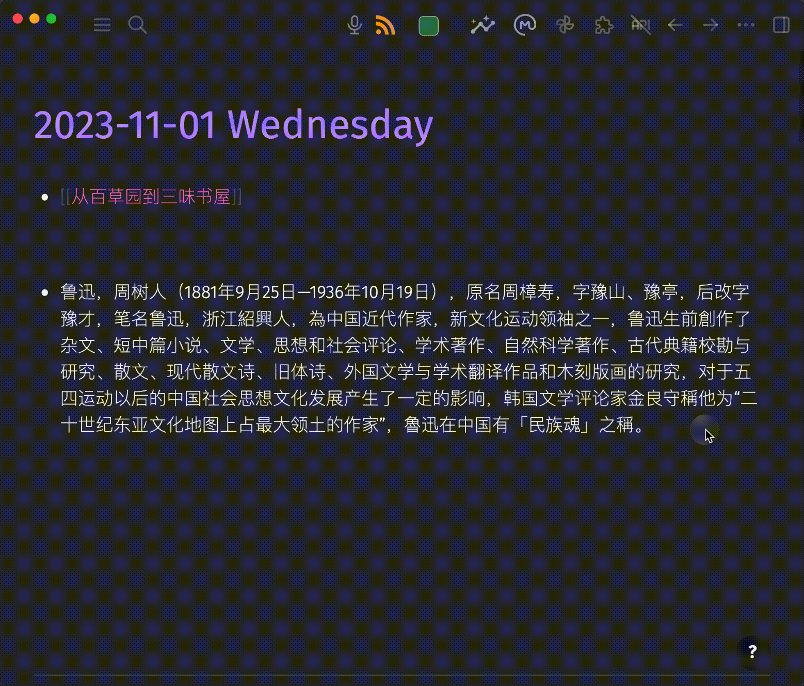

# Logseq AI Auto Tags

A Logseq plugin that uses artificial intelligence to automatically generate relevant tags for your blocks and pages. Stop manually tagging your notes — let AI do its magic!



## Features

- **Block Tagging**: Automatically generate and append tags to any block in your graph.
- **Page Tagging**: Generate tags for entire pages and add them as page properties.
- **Multi-language Support**: Tags are generated in the same language as your content.
- **Customizable AI**: Configure your own API endpoint, key, and model.
- **Smart Tag Formatting**: Tags without spaces use `#tag`; tags with spaces are automatically formatted as `#[[tag with spaces]]`.
- **Multiple Access Points**: Use via slash command, block context menu, or page menu.

## Installation

### From Logseq Marketplace (Recommended)

1. Open Logseq.
2. Go to **... (More) > Plugins > Marketplace**.
3. Search for **AI Auto Tags** or `byp-logseq-ai-auto-tags`.
4. Click **Install** and enable the plugin.

### From Source
If you prefer to build the plugin manually or contribute to its development, please follow the steps in the [Development](#development) section below.

## Usage

The **🤖 AI auto tags** command adapts dynamically based on where you trigger it:

| What you tag | How to trigger | Result |
|--------------|----------------|--------|
| **Single block** | Type `/` in a block → select **🤖 AI auto tags** <br>– OR– <br>Right-click the block → select **🤖 AI auto tags** | Tags are appended directly to the end of the block content. |
| **Entire page** | Click the **...** menu at the top right of any page → select **🤖 AI auto tags** | Tags are added to a `tags::` property block at the very top of the page. |

## Configuration & AI Providers

To set up your AI service:
1. In Logseq, go to **... (More) > Plugins**.
2. Find **AI Auto Tags** and click the **⚙️ (settings)** icon.

### Required Settings

| Setting | Description | Default |
|---------|-------------|---------|
| **API Key** | Your API key for the AI service (leave empty or use dummy text for local LLMs). | *empty* |
| **API Base URL** | The base URL endpoint for your OpenAI-compatible service. | `https://api.openai.com/v1` |
| **Model Name** | The specific model identifier to use for tag generation. | `gpt-4o-mini` |

### Recommended Providers (Free & Paid Options)

The plugin works seamlessly with any OpenAI-compatible API. Below are the most practical setups, leaning heavily toward local and free solutions:

#### 1. Local & Privacy-First (100% Free)
Run open-source models directly on your machine. No internet required, completely private.
* **Ollama**: 
  * **API Base URL**: `http://localhost:11434/v1`
  * **API Key**: `any-string` (Ollama requires a dummy string)
  * **Model Name**: The full Ollama model name (e.g., `gemma4:e4b-it-qat`, `Jadio/Qwen3_4b_thinking_q4km:latest`, etc.)
* **LM Studio**:
  * **API Base URL**: `http://localhost:1234/v1`
  * **API Key**: `any-string`
  * **Model Name**: Enter the exact name of the model currently loaded in LM Studio.

#### 2. Cloud Providers (Free Tiers / Low Cost)
If you prefer not to host models locally but want high performance at little to no cost:
* **OpenRouter / Groq**: Excellent alternative endpoints offering fast, heavily discounted, or completely free tiers for open-source models.
  * **API Base URL**: Use their respective OpenAI-compatible base URLs (e.g., `https://openrouter.ai/api/v1`).
  * **Model Name**: Provide their model string (e.g., `meta-llama/llama-3.2-3b-instruct:free`).
* **OpenAI (Standard Paid)**: Use the default settings with your personal OpenAI API token. A fast and inexpensive model like `gpt-4o-mini`, `gpt-5-mini` or even `gpt-5-nano` should be enough.

---

## How It Works

### Tag Generation Process
1. **Content Collection**: When triggered, the plugin bundles your content:
   * **Blocks**: Gathers the target block and all its nested child blocks.
   * **Pages**: Reads the entire text content of the active page.
2. **AI Analysis**: The content is sent to your AI provider with an optimized system prompt instructing the AI to extract up to 5 highly relevant core concepts, match the document's language, and return a clean JSON payload.
3. **Parsing & Formatting**: Spaces are checked to output `#tag` or `#[[tag with spaces]]`.
4. **Application**: The formatted tags are dynamically written back into Logseq.

### Examples

#### English Content
* **Before**: `This is a note about machine learning algorithms and neural networks.`
* **After**: `This is a note about machine learning algorithms and neural networks. #machine-learning #neural-networks #AI`

#### Chinese Content
* **Before**: `这是关于机器学习和人工智能的笔记`
* **After**: `这是关于机器学习和人工智能的笔记 #机器学习 #人工智能 #深度学习`

---

## Requirements & Limitations

### Requirements
- Logseq version `0.9.0` or higher.
- A valid API key or local LLM endpoint connection.
- An active internet connection (unless using a local LLM like Ollama).

### Limitations
- **Tag Count**: The plugin is hardcoded to generate a maximum of 5 tags per request to keep data concise.
- **Context Windows**: Extremely long pages may hit token limitations depending on your chosen AI model.
- **Quality Dependency**: The accuracy and quality of the tags rely entirely on the capabilities of your configured model.

---

## Troubleshooting

### No Tags Generated
- Verify your API Key is active and has remaining balance/credits.
- Double-check your **API Base URL** formatting (ensure it includes the `/v1` suffix if required by your provider).
- Ensure the **Model Name** matches your provider's expected string exactly.

### Tags in the Wrong Language
- While the system prompt forces the AI to match the source text language, small or ambiguous text blocks can sometimes confuse it. Try adding a brief language hint (write: English Tags) to your content if this happens consistently. If the model is still returning unexpected results, consider switching to a more capable model.
- As a last resort, it might help to update the instruction in the installed plugin's package (Plugins > Logseq AI Auto Tags > ⚙️ Settings > Open package) to explicitly specify the desired language:  
Search for this string and replace the mentioned language and example tags with your desired target language: `"You are a highly intelligent tagging assistant. Your goal is to generate a concise list of highly relevant tags for the provided text. Follow these rules strictly: 1. Generate a maximum of 5 tags. 2. The tags must be extremely relevant to the core concepts of the text. 3. The language of the tags MUST match the language of the provided text (e.g., if the text is in **English**, the tags must be in **English**). 4. Return the tags as a JSON object with a single key "tags" containing an array of strings. For example: {"tags": ["Concept 1", "Core Idea 2"]}.`;"


### API Connection / CORS Errors
- Ensure your local service (like Ollama or Open WebUI) is allowed to receive web origins. (Note: The plugin enables browser mode for the client to bypass standard restrictions where possible).

### Tags Do Not Appear
- Ensure you have write/edit permissions enabled on your current graph.
- Force a re-render by clicking out of the block, or refresh Logseq (`Ctrl+R` or `Cmd+R`).

---

## Privacy

- Your notes are sent directly to your configured endpoint; the plugin does not store, log, or track your content.
- Be cautious when using public proxy services with sensitive data. 
- For total data sovereignty, use a local provider like **Ollama** or **LM Studio**.

---

## Development

### Prerequisites
- Node.js 18+
- pnpm (recommended package manager)
- TypeScript 5+

### Setup & Build

```bash
# Clone the repository
git clone [https://github.com/b-yp/logseq-ai-auto-tags.git](https://github.com/b-yp/logseq-ai-auto-tags.git)
cd logseq-ai-auto-tags

# Install dependencies
pnpm install

# Run development mode (with auto-reload)
pnpm dev

# Build for production
pnpm build
## License

This project is licensed under the MIT License - see the [LICENSE](LICENSE) file for details.
---

**Plugin ID:** `byp-logseq-ai-auto-tags`

**Author:** [b-yp](https://github.com/b-yp)